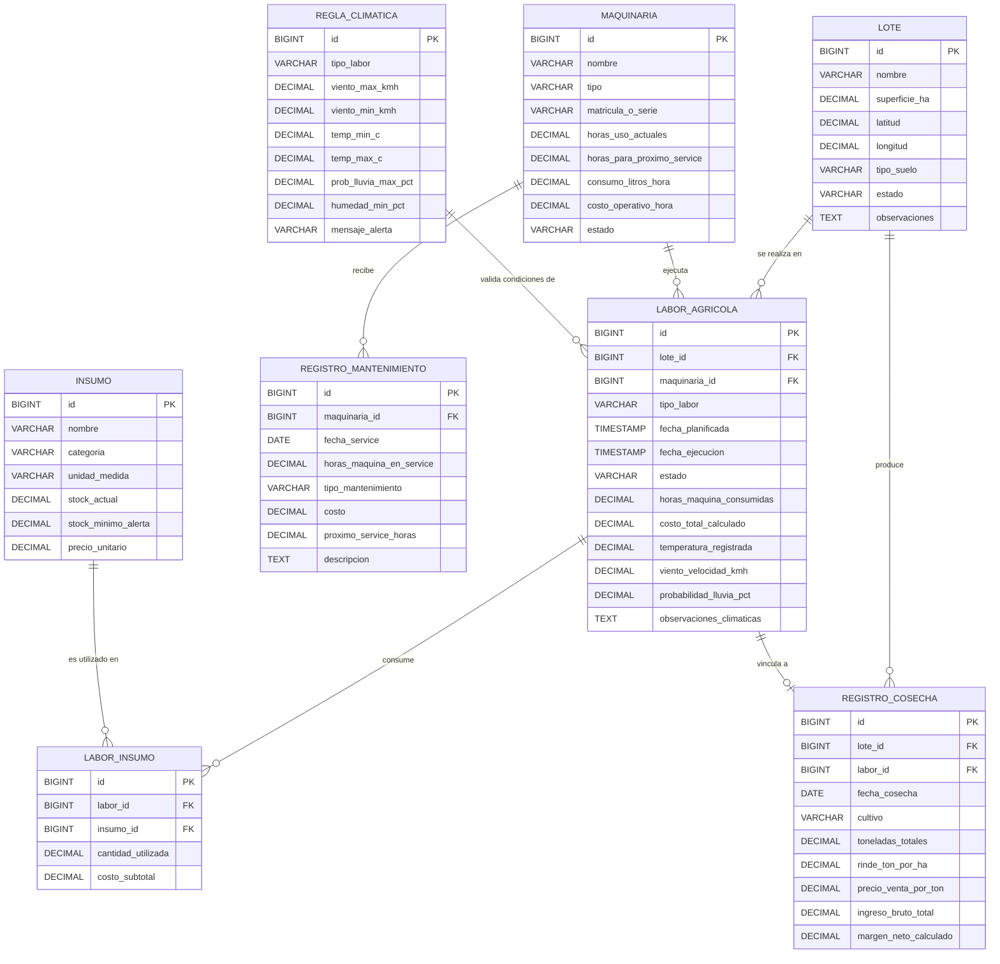

# 2.ª Entrega: Diseño de Base de Datos y Listado de Módulos

**Proyecto:** Sistema AgTech de Gestión y Optimización de Lotes de Cultivo  
**Cátedra:** Trabajo Final Integrador (TFI) — Grupo 107  
**Integrantes:**
* Ruidiaz, Emanuel Facundo
* Roques Zeballos, Juan Martín
* Santini, Mauro Gonzalo

**Tutor:** Prof. Herrera Molas, Gerardo A.  
**Fecha límite de entrega:** 27/09/2026

---

## 1. Introducción y Alcance de la Entrega

El presente documento constituye la **2.ª Entrega** exigida por la cátedra para la obtención de la **Condición de Regular**. En él se formaliza:
1. El **Esquema de Base de Datos Relacional (DER)** que dará soporte integral al ciclo operativo agrícola, trazabilidad de insumos, mantenimiento de maquinaria y costeo financiero por hectárea.
2. El **Diccionario de Datos** detallando tipos de datos, restricciones de integridad referencial y claves foráneas.
3. El **Listado de Módulos a Desarrollar**, especificando las responsabilidades de cada componente, casos de uso principales y servicios REST previstos.

---

## 2. Diagrama Entidad-Relación (DER)

A continuación se presenta el modelo relacional diseñado para la plataforma. El núcleo del sistema gira en torno a la entidad **`labor_agricola`**, que articula el lote, la maquinaria asignada, los insumos consumidos y las condiciones climáticas validadas.

---

## 3. Diccionario de Datos

### 3.1. Tabla `lote`
Representa las parcelas o cuadros productivos del establecimiento agropecuario.

| Columna | Tipo de Dato | Nulo | Descripción / Restricciones |
| :--- | :--- | :--- | :--- |
| `id` | `BIGINT` | NO | Clave Primaria (Autoincremental / Identity). |
| `nombre` | `VARCHAR(100)` | NO | Nombre identificador del lote (ej. "Lote Norte 1"). |
| `superficie_ha` | `DECIMAL(10, 2)` | NO | Superficie del lote en hectáreas (debe ser > 0). |
| `latitud` | `DECIMAL(10, 6)` | NO | Coordenada geográfica decimal para consulta climática. |
| `longitud` | `DECIMAL(10, 6)` | NO | Coordenada geográfica decimal para consulta climática. |
| `tipo_suelo` | `VARCHAR(50)` | SÍ | Clasificación edafológica (Franco, Arcilloso, Arenoso). |
| `estado` | `VARCHAR(30)` | NO | `EN_PREPARACION`, `SEMBRADO`, `EN_CRECIMIENTO`, `LISTO_COSECHA`, `COSECHADO`, `DESCANSO`. |
| `observaciones` | `TEXT` | SÍ | Notas adicionales de manejo agronómico. |

### 3.2. Tabla `insumo`
Almacena el catálogo de insumos agrícolas y su stock actual.

| Columna | Tipo de Dato | Nulo | Descripción / Restricciones |
| :--- | :--- | :--- | :--- |
| `id` | `BIGINT` | NO | Clave Primaria (Identity). |
| `nombre` | `VARCHAR(120)` | NO | Nombre comercial / técnico (ej. "Glifosato 48%", "Semilla Soja DM 46i20"). |
| `categoria` | `VARCHAR(40)` | NO | `SEMILLA`, `FERTILIZANTE`, `FITOSANITARIO`, `COMBUSTIBLE`. |
| `unidad_medida` | `VARCHAR(20)` | NO | `KILOGRAMOS`, `LITROS`, `BOLSAS`, `TONELADAS`. |
| `stock_actual` | `DECIMAL(12, 2)` | NO | Cantidad disponible en depósito (debe ser >= 0). |
| `stock_minimo_alerta` | `DECIMAL(12, 2)` | NO | Punto de reorden para disparar alertas de compra. |
| `precio_unitario` | `DECIMAL(12, 2)` | NO | Costo de adquisición unitario vigente ($ o USD). |

### 3.3. Tabla `maquinaria`
Flota de vehículos y maquinaria pesada agrícola con horómetros y telemetría de desgaste.

| Columna | Tipo de Dato | Nulo | Descripción / Restricciones |
| :--- | :--- | :--- | :--- |
| `id` | `BIGINT` | NO | Clave Primaria (Identity). |
| `nombre` | `VARCHAR(100)` | NO | Marca y modelo (ej. "Tractor John Deere 6110M"). |
| `tipo` | `VARCHAR(40)` | NO | `TRACTOR`, `COSECHADORA`, `PULVERIZADORA`, `SEMBRADORA`, `VEHICULO_APOYO`. |
| `matricula_o_serie` | `VARCHAR(50)` | NO | Número de chasis, serie o patente única. |
| `horas_uso_actuales` | `DECIMAL(10, 2)` | NO | Horas de trabajo acumuladas (horómetro actual). |
| `horas_para_proximo_service`| `DECIMAL(10, 2)` | NO | Horómetro en el que vence el próximo service. |
| `consumo_litros_hora` | `DECIMAL(8, 2)` | NO | Consumo medio de gasoil estimado por hora de labor. |
| `costo_operativo_hora` | `DECIMAL(10, 2)` | NO | Costo fijo/hora (amortización, seguro, mantenimiento previsto). |
| `estado` | `VARCHAR(30)` | NO | `OPERATIVO`, `EN_MANTENIMIENTO`, `EN_LABOR`, `FUERA_DE_SERVICIO`. |

### 3.4. Tabla `registro_mantenimiento`
Historial de servicios mecánicos preventivos y correctivos efectuados a la maquinaria.

| Columna | Tipo de Dato | Nulo | Descripción / Restricciones |
| :--- | :--- | :--- | :--- |
| `id` | `BIGINT` | NO | Clave Primaria (Identity). |
| `maquinaria_id` | `BIGINT` | NO | Clave Foránea (`maquinaria.id`). |
| `fecha_service` | `DATE` | NO | Fecha en que se realizó el mantenimiento. |
| `horas_maquina_en_service` | `DECIMAL(10, 2)` | NO | Lectura del horómetro al momento del service. |
| `tipo_mantenimiento` | `VARCHAR(40)` | NO | `PREVENTIVO_PROGRAMADO`, `CAMBIO_ACEITE_FILTROS`, `CORRECTIVO_ROTURA`. |
| `costo` | `DECIMAL(10, 2)` | NO | Costo total facturado del service (repuestos + mano de obra). |
| `proximo_service_horas` | `DECIMAL(10, 2)` | NO | Nuevo umbral de horómetro fijado para el siguiente service. |
| `descripcion` | `TEXT` | SÍ | Detalle de tareas realizadas y repuestos sustituidos. |

### 3.5. Tabla `labor_agricola`
Entidad transaccional central que registra tareas planificadas y ejecutadas sobre los lotes.

| Columna | Tipo de Dato | Nulo | Descripción / Restricciones |
| :--- | :--- | :--- | :--- |
| `id` | `BIGINT` | NO | Clave Primaria (Identity). |
| `lote_id` | `BIGINT` | NO | Clave Foránea (`lote.id`). |
| `maquinaria_id` | `BIGINT` | SÍ | Clave Foránea (`maquinaria.id`) — Opcional si la labor es manual. |
| `tipo_labor` | `VARCHAR(40)` | NO | `SIEMBRA`, `PULVERIZACION`, `FERTILIZACION`, `COSECHA`, `LABRANZA`. |
| `fecha_planificada` | `TIMESTAMP` | NO | Fecha y hora en que se programa la labor. |
| `fecha_ejecucion` | `TIMESTAMP` | SÍ | Fecha y hora en que se completó efectivamente. |
| `estado` | `VARCHAR(30)` | NO | `PLANIFICADA`, `APROBADA_CLIMA`, `BLOQUEADA_CLIMA`, `EN_EJECUCION`, `COMPLETADA`, `CANCELADA`. |
| `horas_maquina_consumidas` | `DECIMAL(8, 2)` | SÍ | Horas netas de uso registradas al finalizar. |
| `costo_total_calculado` | `DECIMAL(12, 2)` | SÍ | Costo acumulado (insumos + combustible + máquina). |
| `temperatura_registrada` | `DECIMAL(5, 2)` | SÍ | Temperatura ambiente capturada de la API meteorológica. |
| `viento_velocidad_kmh` | `DECIMAL(6, 2)` | SÍ | Velocidad del viento capturada de la API meteorológica. |
| `probabilidad_lluvia_pct` | `DECIMAL(5, 2)` | SÍ | Probabilidad de precipitación capturada de la API. |
| `observaciones_climaticas` | `TEXT` | SÍ | Dictamen del motor de reglas climáticas. |

### 3.6. Tabla `labor_insumo`
Detalle de consumo de insumos por cada labor realizada (relación muchos a muchos con atributos).

| Columna | Tipo de Dato | Nulo | Descripción / Restricciones |
| :--- | :--- | :--- | :--- |
| `id` | `BIGINT` | NO | Clave Primaria (Identity). |
| `labor_id` | `BIGINT` | NO | Clave Foránea (`labor_agricola.id`) con eliminación en cascada. |
| `insumo_id` | `BIGINT` | NO | Clave Foránea (`insumo.id`). |
| `cantidad_utilizada` | `DECIMAL(12, 2)` | NO | Cantidad descontada del stock de insumo. |
| `costo_subtotal` | `DECIMAL(12, 2)` | NO | `cantidad_utilizada * precio_unitario_momento`. |

### 3.7. Tabla `registro_cosecha`
Rendimientos físicos y financieros obtenidos en la cosecha de cada lote.

| Columna | Tipo de Dato | Nulo | Descripción / Restricciones |
| :--- | :--- | :--- | :--- |
| `id` | `BIGINT` | NO | Clave Primaria (Identity). |
| `lote_id` | `BIGINT` | NO | Clave Foránea (`lote.id`). |
| `labor_id` | `BIGINT` | SÍ | Clave Foránea opcional a la labor de tipo `COSECHA`. |
| `fecha_cosecha` | `DATE` | NO | Fecha de cierre de la recolección. |
| `cultivo` | `VARCHAR(60)` | NO | Especie recolectada (ej. "Soja 1.ª", "Maíz tardío"). |
| `toneladas_totales` | `DECIMAL(10, 2)` | NO | Producción neta cosechada. |
| `rinde_ton_por_ha` | `DECIMAL(8, 2)` | NO | Rendimiento relativo: `toneladas_totales / lote.superficie_ha`. |
| `precio_venta_por_ton` | `DECIMAL(12, 2)` | NO | Precio de mercado liquidado por tonelada. |
| `ingreso_bruto_total` | `DECIMAL(14, 2)` | NO | `toneladas_totales * precio_venta_por_ton`. |
| `margen_neto_calculado`| `DECIMAL(14, 2)` | NO | `ingreso_bruto_total - costos_acumulados_lote`. |

### 3.8. Tabla `regla_climatica`
Parámetros agronómicos configurables para evaluar la aptitud climática de cada labor.

| Columna | Tipo de Dato | Nulo | Descripción / Restricciones |
| :--- | :--- | :--- | :--- |
| `id` | `BIGINT` | NO | Clave Primaria (Identity). |
| `tipo_labor` | `VARCHAR(40)` | NO | `PULVERIZACION`, `SIEMBRA`, `COSECHA`, `FERTILIZACION`. |
| `viento_max_kmh` | `DECIMAL(5, 2)` | NO | Velocidad máxima admisible de viento (ej. 15 km/h en pulverización). |
| `viento_min_kmh` | `DECIMAL(5, 2)` | NO | Viento mínimo (ej. 2 km/h para evitar inversión térmica). |
| `temp_min_c` | `DECIMAL(5, 2)` | NO | Temperatura mínima operativa. |
| `temp_max_c` | `DECIMAL(5, 2)` | NO | Temperatura máxima operativa (ej. 30 °C). |
| `prob_lluvia_max_pct` | `DECIMAL(5, 2)` | NO | Probabilidad máxima de precipitaciones tolerada. |
| `humedad_min_pct` | `DECIMAL(5, 2)` | NO | Humedad relativa mínima requerida. |
| `mensaje_alerta` | `VARCHAR(255)` | NO | Mensaje explicativo para el usuario en caso de bloqueo. |

---

## 4. Listado de Módulos a Desarrollar

A continuación se detalla la descomposición funcional del software en **6 módulos principales**:

### Módulo 1: Catastro y Gestión de Lotes (ABM)
* **Objetivo:** Administrar las parcelas agrícolas del establecimiento, su geolocalización y estado productivo.
* **Funcionalidades:**
  * Alta, baja lógica y edición de lotes con cálculo de superficie.
  * Registro de coordenadas geográficas (latitud y longitud) del centroide del lote.
  * Visualización del estado del ciclo de cultivo (`EN_PREPARACION`, `SEMBRADO`, `LISTO_COSECHA`, etc.).
  * Ficha histórica del lote con todas las labores ejecutadas.
* **Endpoints API REST previstos:**
  * `GET /api/v1/lotes`: Listado de todos los lotes.
  * `GET /api/v1/lotes/{id}`: Detalle de un lote con su resumen histórico.
  * `POST /api/v1/lotes`: Alta de nuevo lote.
  * `PUT /api/v1/lotes/{id}`: Actualización de datos del lote.
  * `DELETE /api/v1/lotes/{id}`: Baja o inactivación del lote.

### Módulo 2: Inventario y Control de Stock de Insumos (ABM)
* **Objetivo:** Mantener la trazabilidad, disponibilidad física y valuación del stock de insumos agronómicos.
* **Funcionalidades:**
  * Gestión de insumos categorizados (semillas, fertilizantes, fitosanitarios, gasoil).
  * Movimientos de stock (ingreso de compras y egreso por aplicación en labores).
  * Alerta visual de stock crítico (`stock_actual <= stock_minimo_alerta`).
  * Actualización de precios unitarios para imputación automática de costos.
* **Endpoints API REST previstos:**
  * `GET /api/v1/insumos`: Catálogo con niveles de stock y filtros por categoría.
  * `GET /api/v1/insumos/alertas-stock`: Listado de insumos que alcanzaron el punto de reposición.
  * `POST /api/v1/insumos`: Registro de nuevo insumo.
  * `PUT /api/v1/insumos/{id}`: Edición de insumo o actualización de precio/stock.
  * `POST /api/v1/insumos/{id}/ajuste`: Registro manual de ajuste de inventario.

### Módulo 3: Parque de Maquinaria y Mantenimiento Predictivo
* **Objetivo:** Controlar las horas de uso de tractores y cosechadoras, anticipando servicios técnicos para evitar tiempos muertos (*downtime*).
* **Funcionalidades:**
  * Registro y control de horas de horómetro acumuladas.
  * Disparo automático de alertas preventivas cuando `horas_uso_actuales >= horas_para_proximo_service`.
  * Registro de órdenes de mantenimiento preventivo y correctivo, registrando costos y reiniciando el intervalo de service.
  * Estimación de consumo de combustible por hora para costeo operativo.
* **Endpoints API REST previstos:**
  * `GET /api/v1/maquinarias`: Listado de maquinarias con horas acumuladas y estado.
  * `GET /api/v1/maquinarias/alertas-service`: Maquinarias que requieren service inmediato.
  * `POST /api/v1/maquinarias`: Alta de maquinaria.
  * `POST /api/v1/maquinarias/{id}/mantenimientos`: Registro de service efectuado.
  * `GET /api/v1/maquinarias/{id}/historial`: Historial de mantenimientos de una máquina.

### Módulo 4: Asistente de Planificación Inteligente con Clima y Geolocalización
* **Objetivo:** Evaluar la viabilidad climática de tareas agrícolas consultando APIs meteorológicas en tiempo real según la ubicación del lote.
* **Funcionalidades:**
  * Integración con API meteorológica externa (Open-Meteo / WeatherAPI) mediante `latitud` y `longitud` del lote.
  * Motor de reglas agronómicas: compara viento, lluvia, temperatura y humedad con los límites configurados en `regla_climatica`.
  * Bloqueo preventivo de labores no aptas (ej. ráfagas > 15 km/h impiden pulverización por deriva de agroquímicos).
  * Panel de sugerencia de ventana horaria óptima para reprogramar la tarea.
* **Endpoints API REST previstos:**
  * `GET /api/v1/clima/pronostico?lat={lat}&lon={lon}`: Consulta climática en tiempo real para un punto geográfico.
  * `POST /api/v1/clima/validar-labor`: Valida si una labor propuesta es segura según el pronóstico.
  * `GET /api/v1/reglas-climaticas`: Consulta y parametrización de umbrales agronómicos.

### Módulo 5: Gestión de Labores Agrícolas y Órdenes de Trabajo
* **Objetivo:** Articular la programación, ejecución y cierre de actividades a campo, actualizando automáticamente stock y horas de maquinaria.
* **Funcionalidades:**
  * Planificación de labores (Siembra, Pulverización, Fertilización, Cosecha).
  * Asignación de lote, máquina e insumos requeridos con sus dosis.
  * Transición de estados: `PLANIFICADA` -> `APROBADA_CLIMA` -> `EN_EJECUCION` -> `COMPLETADA`.
  * Al completarse la labor:
    * Se descuenta el stock de insumos en `insumo`.
    * Se suman las horas de labor a `maquinaria.horas_uso_actuales`.
    * Se calcula el costo total de la labor: $\text{Costo Insumos} + (\text{Horas} \times \text{Costo Operativo/h}) + (\text{Horas} \times \text{Consumo Combustible/h} \times \text{Precio Combustible})$.
* **Endpoints API REST previstos:**
  * `GET /api/v1/labores`: Listado de labores con filtros por lote, estado y fecha.
  * `POST /api/v1/labores`: Creación de orden de labor.
  * `POST /api/v1/labores/{id}/ejecutar`: Inicio de ejecución de la labor.
  * `POST /api/v1/labores/{id}/finalizar`: Cierre de la labor con carga de horas reales e insumos consumidos.
  * `POST /api/v1/labores/{id}/cancelar`: Cancelación de labor.

### Módulo 6: Registro de Cosechas y Tablero Financiero (ROI por Lote)
* **Objetivo:** Consolidar el resultado agronómico y económico final de cada lote, calculando el rendimiento por hectárea y el margen neto.
* **Funcionalidades:**
  * Registro de toneladas cosechadas por cultivo en cada lote.
  * Cálculo automático de rinde promedio ($\text{tn/ha} = \frac{\text{toneladas totales}}{\text{superficie ha}}$).
  * Imputación de ingresos por venta ($\text{tn} \times \text{precio/tn}$).
  * Cruce automático contra la suma de costos de todas las labores previas del lote para obtener el Margen Neto y ROI.
  * Tablero visual para comparar rentabilidad entre lotes y tipos de cultivo.
* **Endpoints API REST previstos:**
  * `GET /api/v1/cosechas`: Historial de cosechas registradas.
  * `POST /api/v1/cosechas`: Registro de cosecha de un lote.
  * `GET /api/v1/analiticas/lote/{id}/roi`: Resumen financiero consolidado del lote (ingresos, costos de labores, margen neto y ROI).
  * `GET /api/v1/analiticas/dashboard`: Métricas generales del establecimiento (total cosechado, costos acumulados, alertas activas).

---

## 5. Justificación Tecnológica para la Entrega

* **Compatibilidad de Persistencia:** El esquema relacional ha sido normalizado hasta la Tercera Forma Normal (3FN), garantizando integridad referencial mediante claves foráneas y restricciones `CHECK`.
* **Multientorno Spring Boot:** El script DDL generado es 100% compatible tanto con el perfil local **H2 Database** (modo desarrollo/testing sin dependencias) como con **PostgreSQL** desplegado en la nube (perfil de producción para cumplimiento de despliegue).
