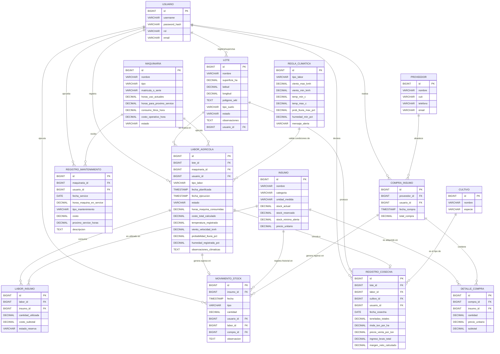

# 2. Diagrama Entidad-Relación (DER)

A continuación se presenta el modelo relacional diseñado para la plataforma. El núcleo del sistema gira en torno a la entidad **`labor_agricola`**, que articula el lote, la maquinaria asignada, los insumos consumidos y las condiciones climáticas validadas. Se han incorporado las entidades de **Usuario**, **Compras** y trazabilidad de **Movimientos de Stock**, así como **Cultivo** como catálogo independiente.

### 2.1. Reserva lógica de stock

Para dar soporte al caso de uso **CU-03 (Programar Labor Agrícola)**, el modelo incorpora la **reserva de stock** sin necesidad de una tabla adicional:

* **`insumo.stock_reservado`**: cantidad del insumo comprometida por labores planificadas que todavía no se ejecutaron. El stock que puede asignarse a una nueva labor es el **stock disponible**: `stock_actual - stock_reservado`.
* **`labor_insumo.estado_reserva`**: indica en qué situación se encuentra cada línea de insumo de una labor:
  * `RESERVADO`: la labor está planificada y la cantidad está comprometida (suma en `stock_reservado`).
  * `CONSUMIDO`: la labor se inició, se descontó el stock físico y se registró un `EGRESO_LABOR` en `movimiento_stock`.
  * `LIBERADO`: la labor se canceló y la cantidad volvió a estar disponible.

La reserva no genera registros en `movimiento_stock` porque no altera el stock físico; sólo el consumo real (`EGRESO_LABOR`) queda en el historial de movimientos. Las transiciones completas se documentan en [06_reglas_negocio_casos_uso.md](./06_reglas_negocio_casos_uso.md#63-estados-de-negocio-y-transiciones).
