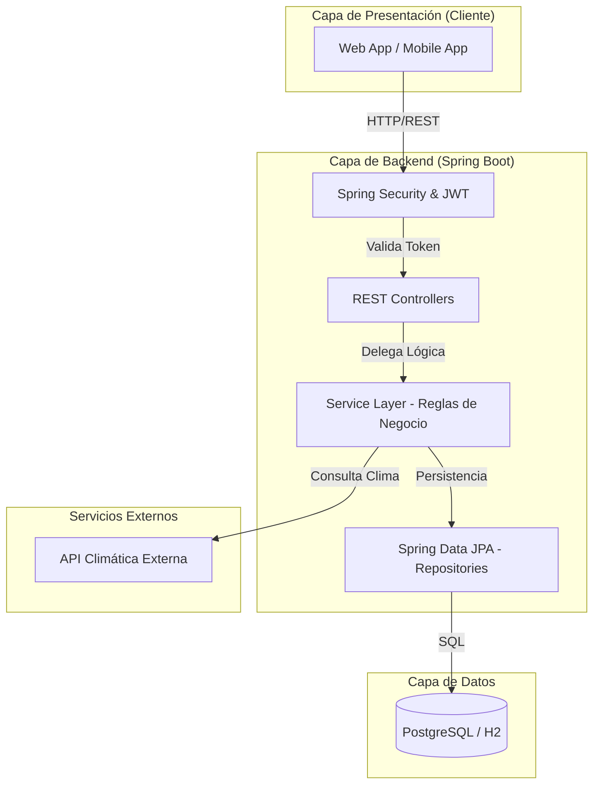
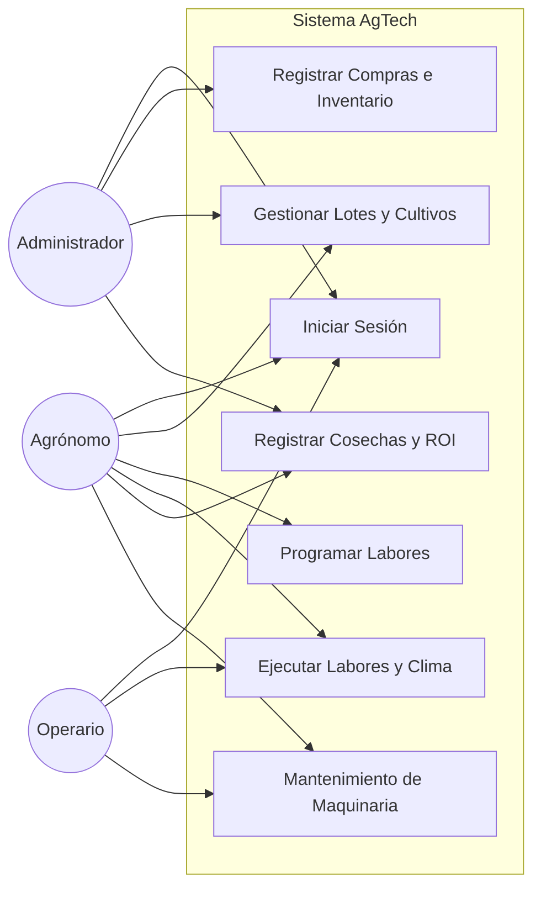

# 8. Diagramas Complementarios

## 8.1. Diagrama de Arquitectura (N-Capas)

El siguiente diagrama detalla la arquitectura de alto nivel y la separación de responsabilidades:

## 8.2. Diagrama de Casos de Uso

Se visualizan las interacciones principales de los actores del sistema con los módulos de la aplicación:

