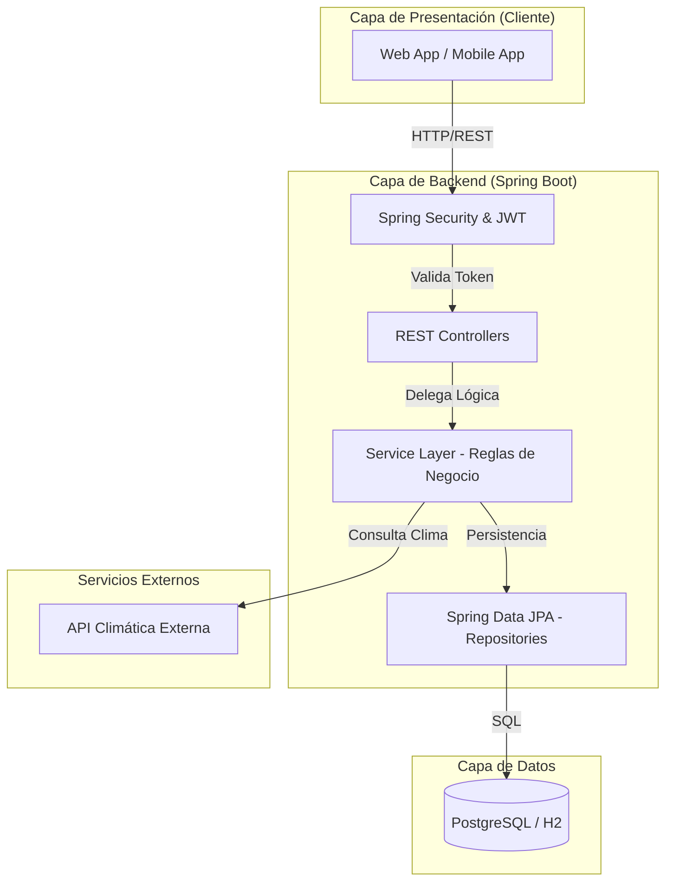
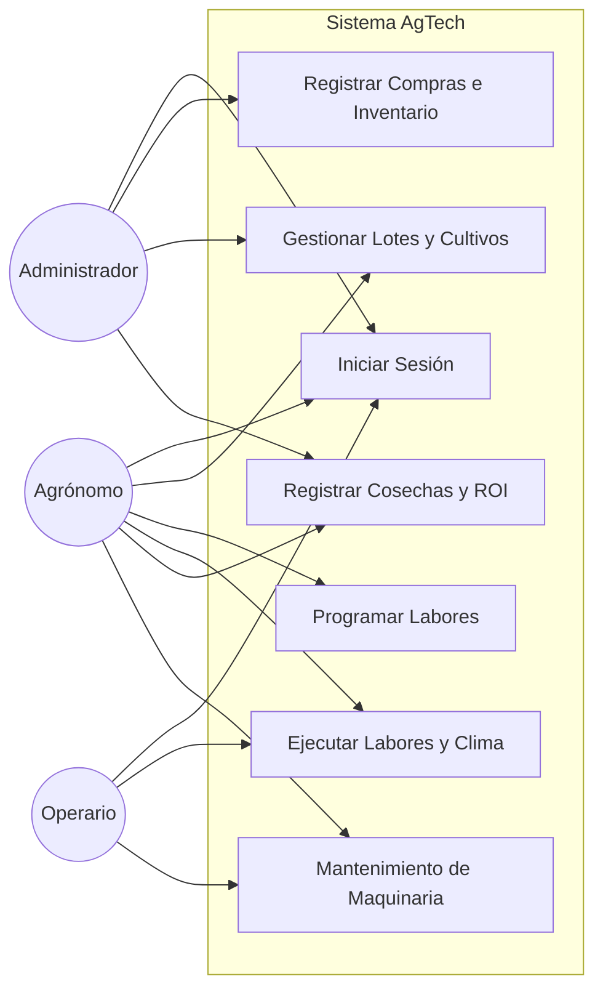
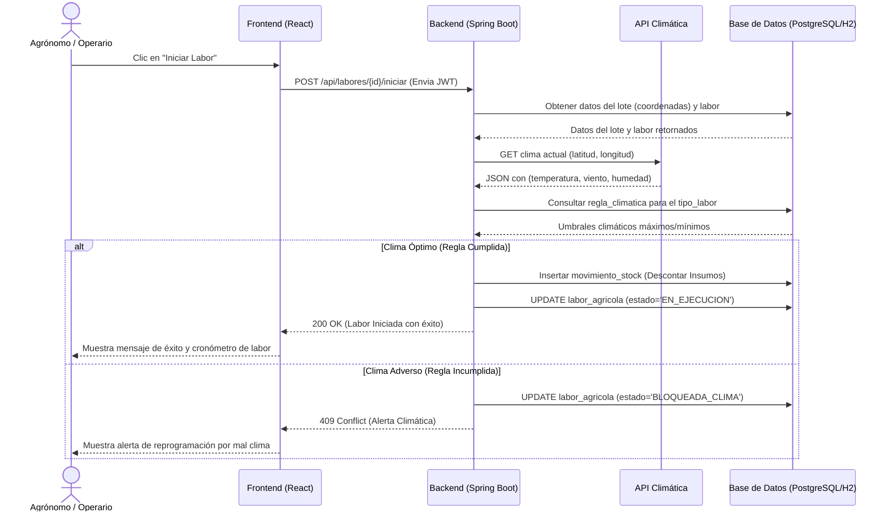

# 8. Diagramas Complementarios

## 8.1. Diagrama de Arquitectura (N-Capas)

El siguiente diagrama detalla la arquitectura de alto nivel y la separación de responsabilidades:

## 8.2. Diagrama de Casos de Uso

Se visualizan las interacciones principales de los actores del sistema con los módulos de la aplicación:

## 8.3. Diagrama de Secuencia (Validación Climática)

Este diagrama ilustra el flujo de comunicación dinámico entre los componentes del sistema (Frontend, Backend, Base de Datos y Servicios Externos) durante la ejecución del Caso de Uso CU-04. Demuestra cómo se aplican las reglas de negocio en tiempo real.

