# 8. Diagramas Complementarios

## 8.1. Diagrama de Arquitectura (N-Capas)

El siguiente diagrama detalla la arquitectura de alto nivel y la separación de responsabilidades:

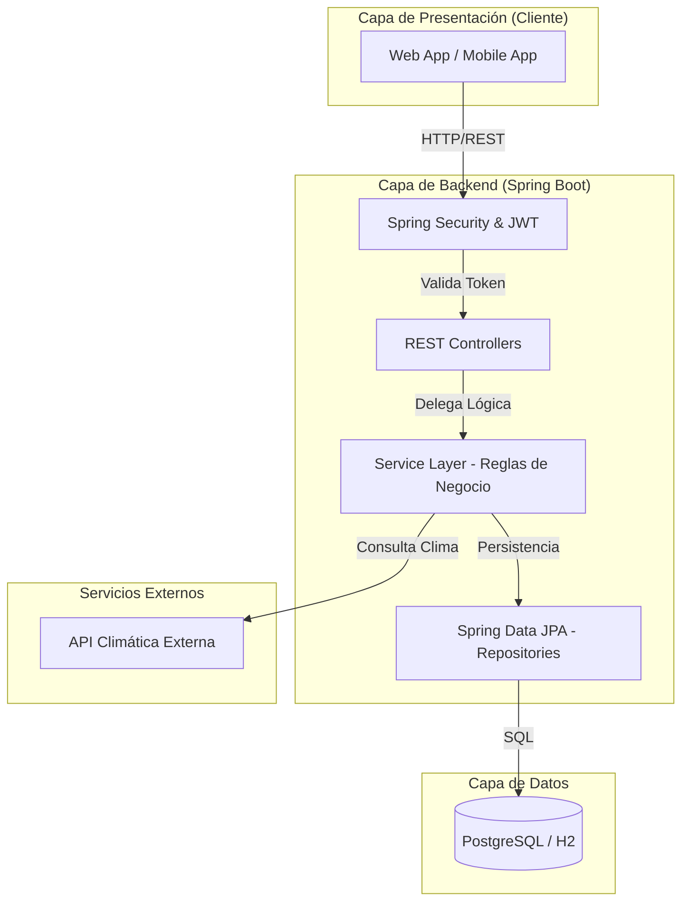

## 8.2. Diagrama de Casos de Uso

Se visualizan las interacciones principales de los actores del sistema con los módulos de la aplicación:

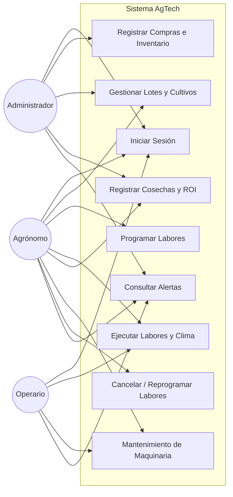

*Correspondencia con los casos de uso del doc 06:* CU1 → CU-01 · CU2 → CU-02 · CU3 → CU-07 · CU4 → CU-03 · CU5 → CU-04 · CU6 → CU-05 · CU7 → CU-06 · CU8 → CU-08 · CU9 → CU-09.

## 8.3. Diagrama de Secuencia (Validación Climática)

Este diagrama ilustra el flujo de comunicación dinámico entre los componentes del sistema (Frontend, Backend, Base de Datos y Servicios Externos) durante la ejecución del Caso de Uso CU-04. Demuestra cómo se aplican las reglas de negocio en tiempo real.

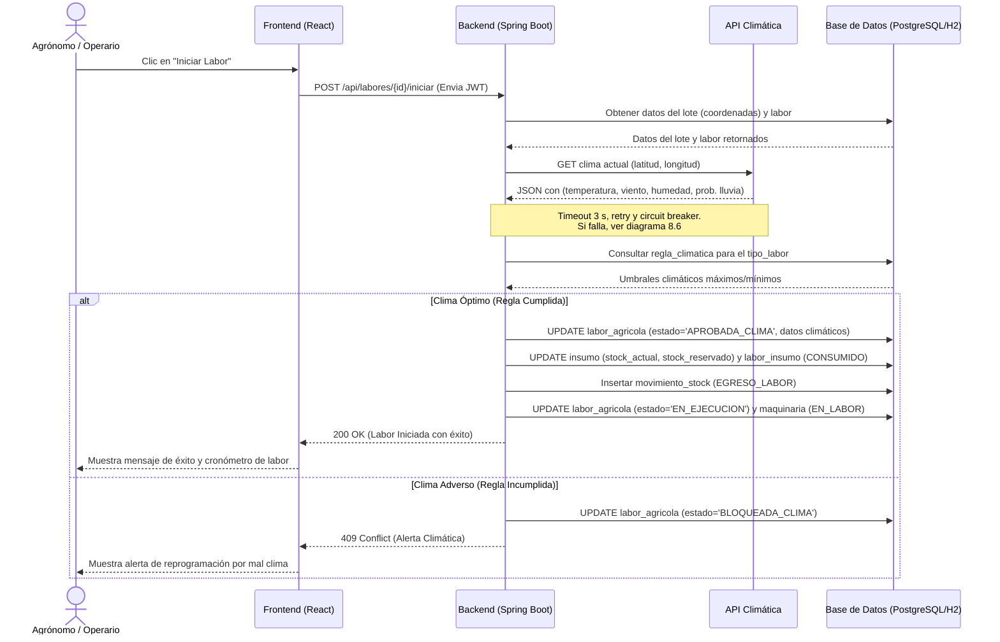

## 8.4. Diagramas de Estado

Representan gráficamente las transiciones formalizadas en [06_reglas_negocio_casos_uso.md](./06_reglas_negocio_casos_uso.md#63-estados-de-negocio-y-transiciones) (RN-08).

### 8.4.1. Lote

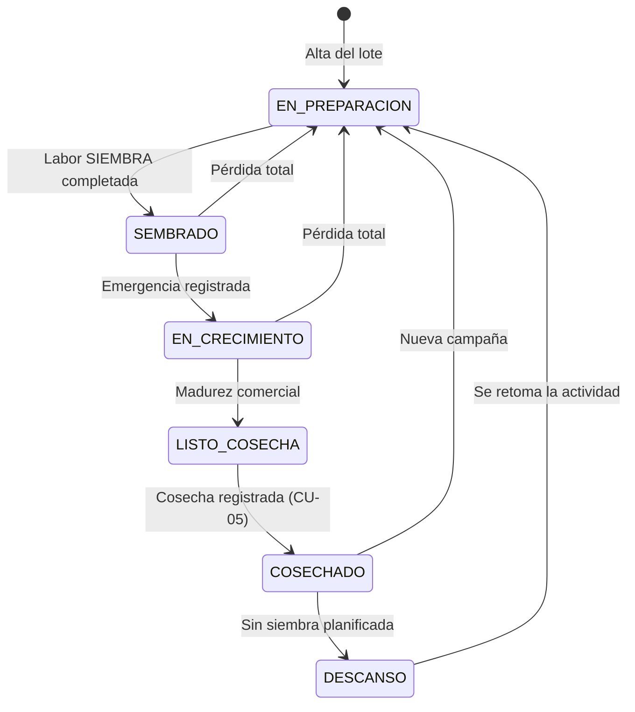

### 8.4.2. Labor Agrícola

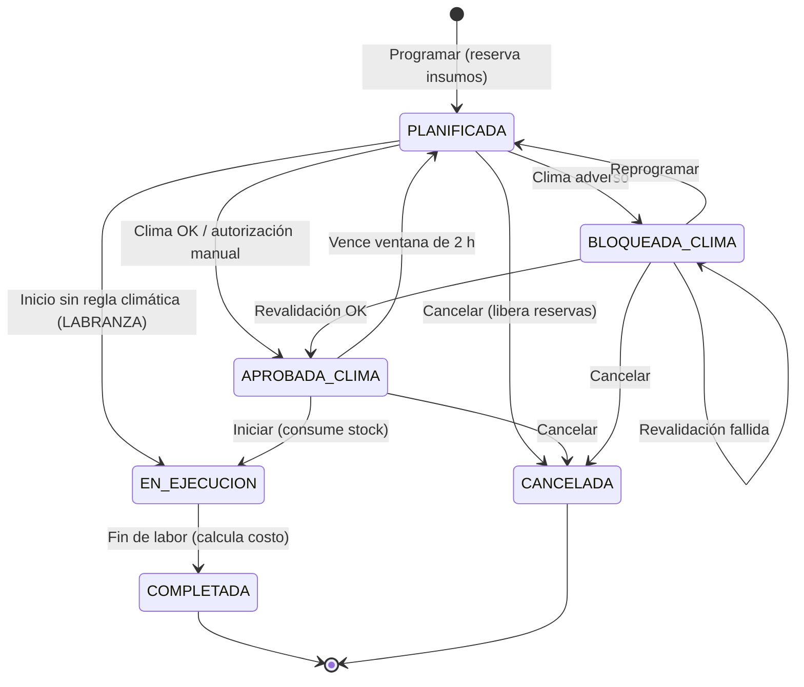

### 8.4.3. Maquinaria

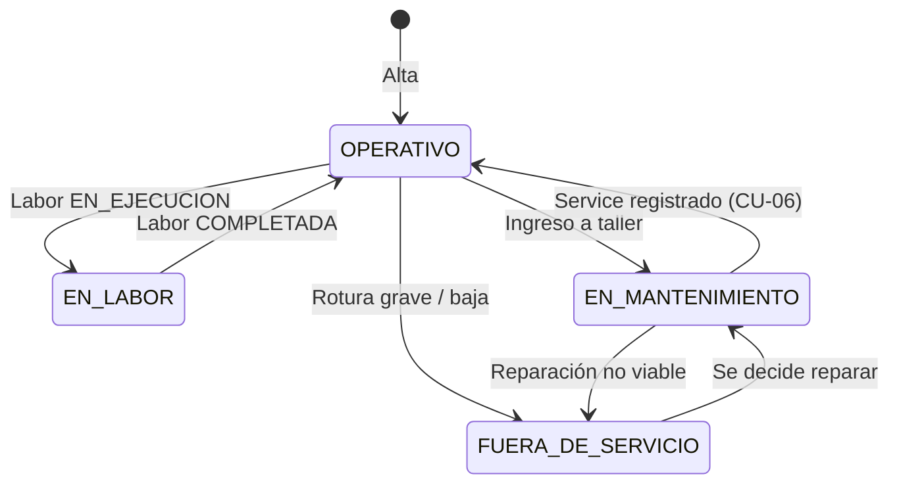

### 8.4.4. Reserva de Insumo (`labor_insumo`)

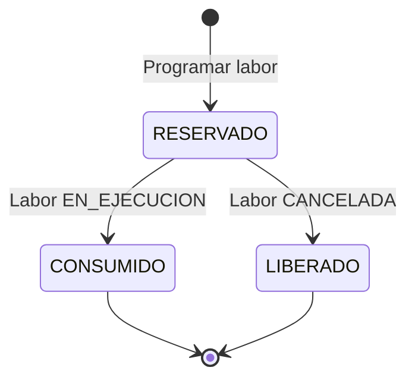

## 8.5. Diagrama de Clases del Dominio

Modelo de clases de las entidades JPA y sus principales responsabilidades. Los métodos de transición encapsulan las reglas de la sección 6.3, de modo que un estado inválido no pueda asignarse desde fuera de la entidad.

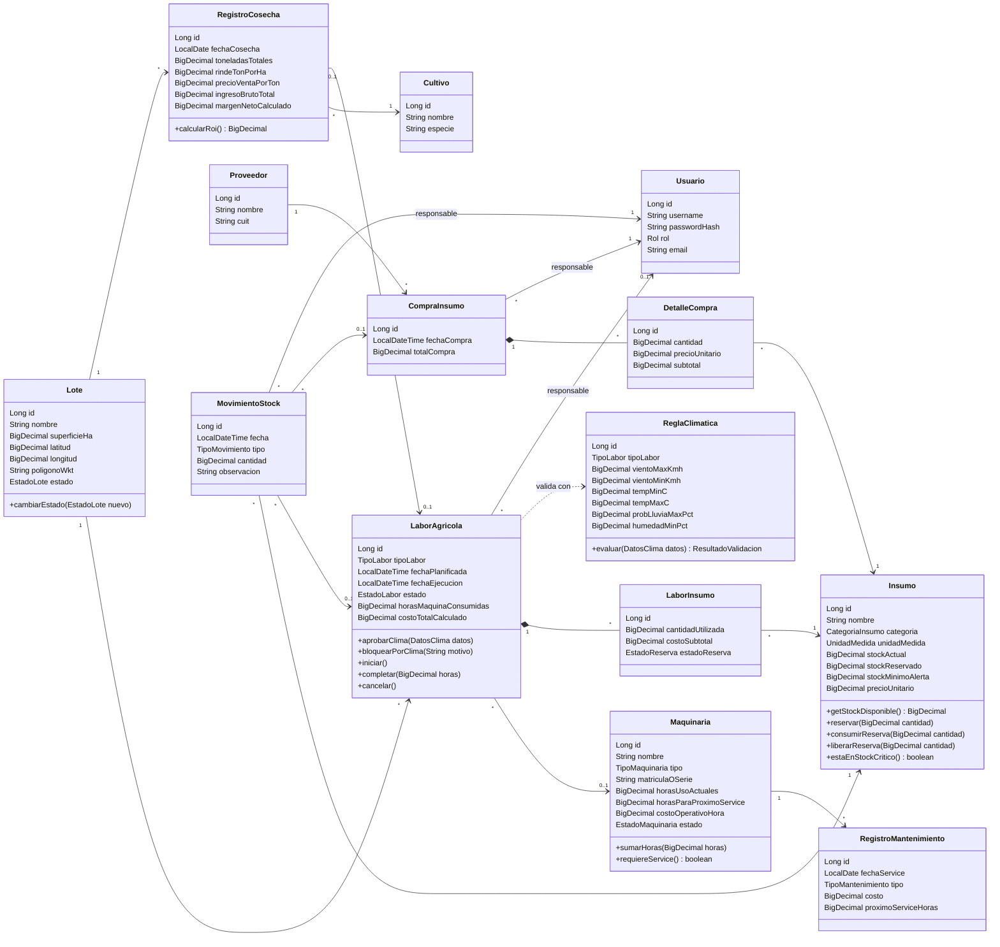

## 8.6. Diagrama de Secuencia (Contingencia ante caída de la API Climática)

Detalla el flujo alternativo 3a del CU-04 y la estrategia de la sección 7.3 del doc 07.

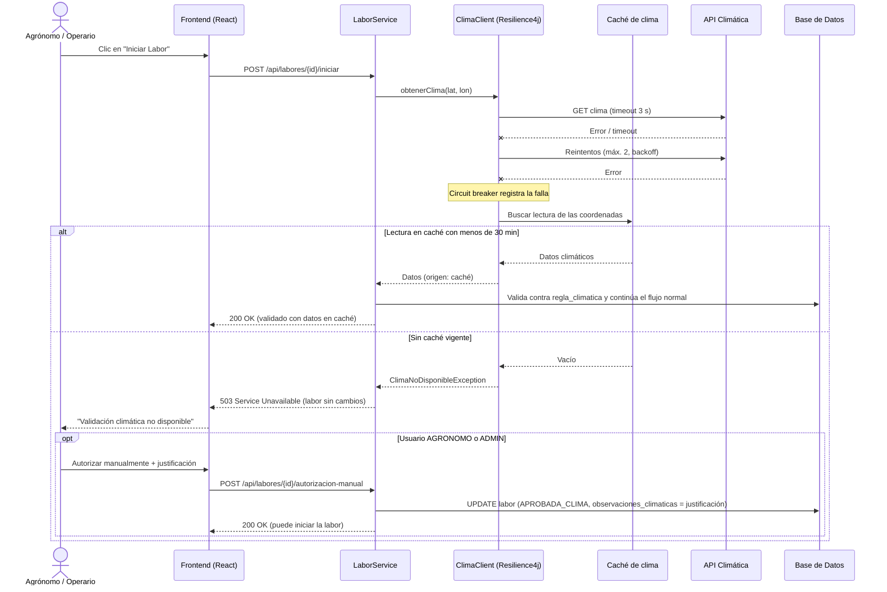

## 8.7. Diagrama de Secuencia (Registrar Compra de Insumos)

Flujo del CU-02. Toda la operación se ejecuta en una única transacción: si falla una línea, no se persiste ninguna.

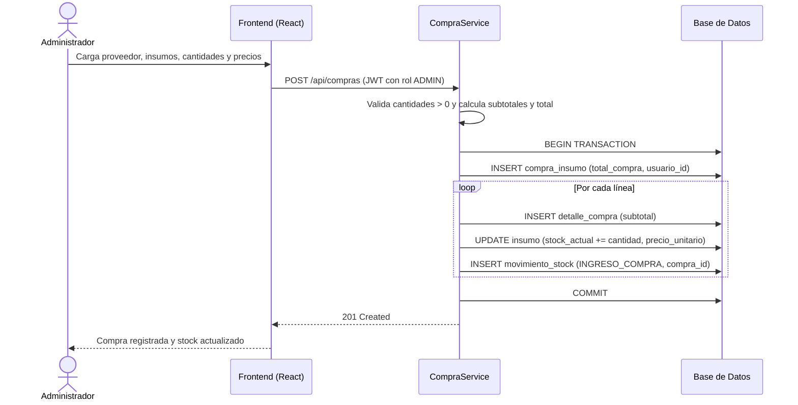

## 8.8. Diagrama de Actividad (Programar Labor con Reserva de Stock)

Flujo del CU-03 y de la regla RN-07.

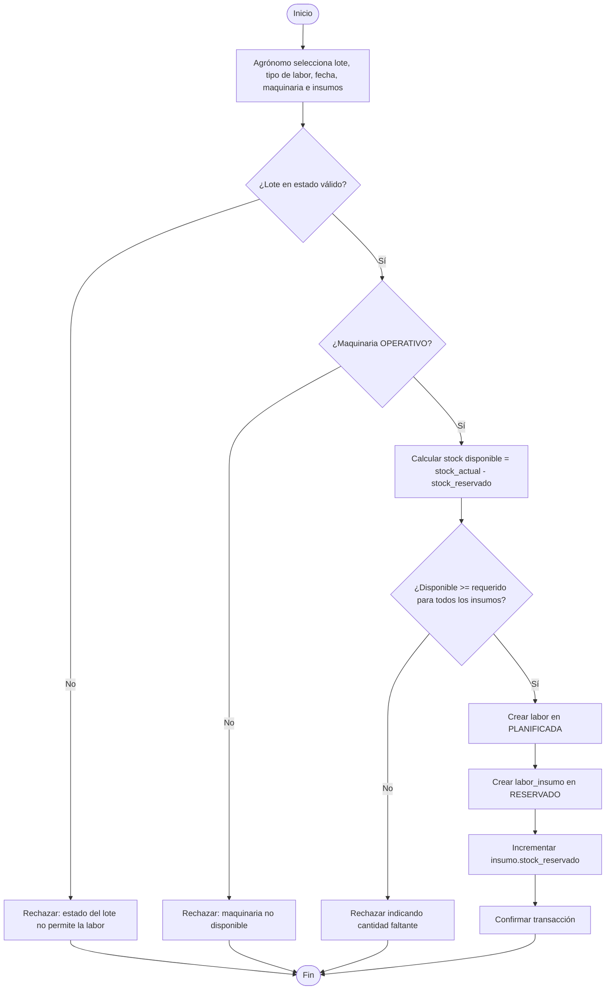

## 8.9. Diagrama de Despliegue

Distribución física de los componentes en el perfil `prod`.

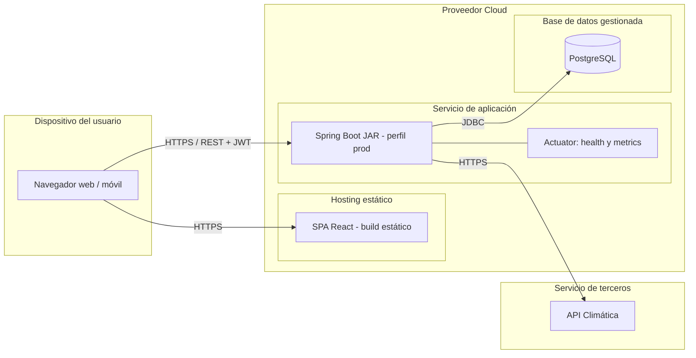
